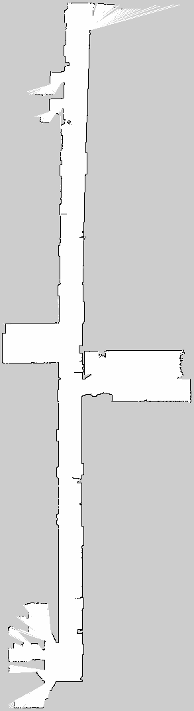

# 📙 Lidar Mapper Setup

<p align="left">
  
  
</p>

> basic guide to use lidar mapper from slamtec


## 💥 How to use 

- Make Catkin Workspace:
```bash
mkdir -p ~/catkin_ws/src
cd ~/catkin_ws/src/
```

- Get Files:
```bash
git clone https://github.com/ZimaUSP/lidar_mapper_setup.git
cd ..
```

- Build environment and set work path:
```bash
catkin make
source devel/setup.bash
```

- Turn On the lidar and connect to mapper wifi

- Launch mapper:
```bash
roslaunch slamware_ros_sdk slamware_ros_sdk_server_node.launch ip_address:=192.168.11.1
```

- Launch Rviz and start mapping:
```bash
roslaunch slamware_ros_sdk view_slamware_ros_sdk_server_node.launch
```

- Save Map:
```bash
rosrun map_server map_saver -f new_map_name map:=map_topic_in_rviz
```

## 📖 Examples

<p align="center">
  
</p>
